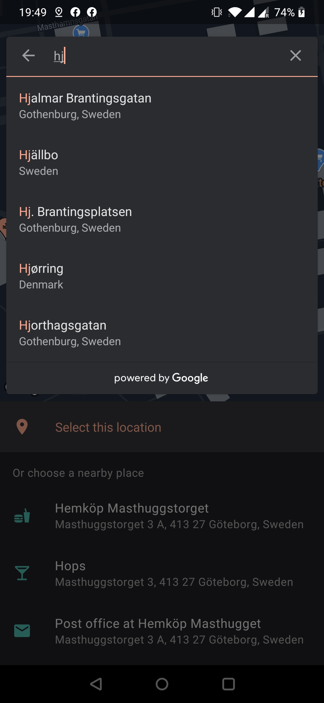

# PING - Because Ping Is Not Google's Place Picker 😉
[](https://jitpack.io/#rtchagas/pingplacepicker) [](#)

 
If you're here looking for a place picker you have probably read this:


As of the end of January 2019, Google deprecated the so useful Place Picker bundled in the Places SDK for Android.
The main reason was due the new pricing model of the [Places API](https://developers.google.com/places/android-sdk/usage-and-billing).

**PING** Place Picker is here to help you to (almost) plug-and-play replace the original Google's Place Picker.

   

## A key difference

Different than Google's Place Picker, PING by default **doesn't** search for places according to where the user is pointing the map to. Instead, it shows only the nearby places in the **current** location.

This was intentional and the reason is simple. By using the **/nearbysearch** from [Google Places Web API](https://developers.google.com/places/web-service/search#PlaceSearchRequests) we are going to be charged *a lot* for each map movement.


According to [Nearby Search pricing](https://developers.google.com/maps/billing/understanding-cost-of-use#nearby-search) each request to the API is going to cost 0.04 USD per each (40.00 USD per 1000).

To avoid the extra cost of **/nearbysearch**, PING relies on Place API's **findCurrentPlace()** that is going to cost 0.030 USD per each  (30.00 USD per 1000).

Moreover, we don't fire a new request when the user moves the map.

## Enabling nearby searches

If you do want to fetch places from a custom location or refresh them when the user moves the map, you must enable /nearbysearch queries in PING.

To do that, enable this flag in your project:
```xml  
 <bool name="enable_nearby_search">true</bool>
```

By doing so, PING behaviour will be slightly changed:
- All places will be fetched by /nearbysearch queries.
- You get a button to refresh the places for the current location.
- You can set the initial map position to get the places from via `pingBuilder.setLatLng(LatLng)`

## Why use PING?

PING is based entirely on Google Places and MAPs APIs. Google has the biggest places database available to us developers with most up to date and curated places information.

It is worth to notice that Google provides US$ 200 (free) per month to be used with Places API. This should be more than enough for small applications that rely on Places data.

## Download

Add Jitpack in your root build.gradle at the end of repositories:

```gradle
    allprojects {
        repositories {
            ...
            maven { url 'https://jitpack.io' }
        }
    }
```

Step 2. Add the dependency

```gradle
    dependencies {
            // Places library
            implementation 'com.google.android.libraries.places:places:2.0.0'
            // PING Place Picker
            implementation 'com.github.rtchagas:pingplacepicker:2.0.+'
    }
```

## Setup

 1. Add Google Play Services to your project - [How to](https://developers.google.com/android/guides/setup)
 2. Sign up for API keys - [How to](https://developers.google.com/places/android-sdk/signup)
 3. Add the Android API key to your **AndroidManifest** file as in the [sample project](https://github.com/rtchagas/pingplacepicker/blob/master/sample/src/main/AndroidManifest.xml#L15).
 4. Optional but strongly recommended to enable R8 in you *[gradle.properties](https://github.com/rtchagas/pingplacepicker/blob/master/gradle.properties#L12)* file

## Hands on

Check the [sample](https://github.com/rtchagas/pingplacepicker/tree/master/sample) project for a full working example.

### - Kotlin
```kotlin
    private fun showPlacePicker() {  
        val builder = PingPlacePicker.IntentBuilder()
	builder.setAndroidApiKey("YOUR_ANDROID_API_KEY")  
        	.setMapsApiKey("YOUR_MAPS_API_KEY")
	
	// If you want to set a initial location rather then the current device location.
	// NOTE: enable_nearby_search MUST be true.
        // builder.setLatLng(LatLng(37.4219999, -122.0862462))
	
        try {
            val placeIntent = pingBuilder.build(this)
            startActivityForResult(placeIntent, REQUEST_PLACE_PICKER)
        }
        catch (ex: Exception) {  
            toast("Google Play Services is not Available")  
        }
    }
    
    override fun onActivityResult(requestCode: Int, resultCode: Int, data: Intent?) {  
	super.onActivityResult(requestCode, resultCode, data)  
	if ((requestCode == REQUEST_PLACE_PICKER) && (resultCode == Activity.RESULT_OK)) {  
	    val place: Place? = PingPlacePicker.getPlace(data!!)  
	    toast("You selected: ${place?.name}")  
	}  
    }
```

### - Java
```java
    private void showPlacePicker() {
	PingPlacePicker.IntentBuilder builder = new PingPlacePicker.IntentBuilder();
	builder.setAndroidApiKey("YOUR_ANDROID_API_KEY")
	       .setMapsApiKey("YOUR_MAPS_API_KEY");
	
	// If you want to set a initial location rather then the current device location.
	// NOTE: enable_nearby_search MUST be true.
        // builder.setLatLng(new LatLng(37.4219999, -122.0862462))
	
	try {
	    Intent placeIntent = builder.build(getActivity());  
	    startActivityForResult(placeIntent, REQUEST_PLACE_PICKER);  
	}  
	catch (Exception ex) {  
	    // Google Play services is not available... 
	}
    }
    
    @Override  
    public void onActivityResult(int requestCode, int resultCode, Intent data) {  
        if ((requestCode == REQUEST_PLACE_PICKER) && (resultCode == RESULT_OK)) {  
            Place place = PingPlacePicker.getPlace(data);  
	    if (place != null) {  
                Toast.makeText(this, "You selected the place: " + place.getName(), Toast.LENGTH_SHORT).show();
            }  
        }
    }
```

## API Keys

PING needs two API keys in order to work.

It was decided to split the API keys to clearly distinguish what you're going to be charged for. Also, the Places Web API and the Geocoding API don't allow an Android API key to be used. To not expose an unrestricted key for all APIs, the Maps API key is now required.

| Key | Restriction | Purpose
|--|--|--|
| Android key | [Android Applications](https://developers.google.com/places/android-sdk/signup#restrict-key) | Used as the Places API key. Main purpose is to retrieve the current places and place details.
| Maps key | [APIs: Geocoding, Maps Static and Places API only](https://cloud.google.com/docs/authentication/api-keys#api_key_restrictions) | Used to fetch static maps, nearby places through Places Web API and perform reverse geocoding on the current user position. That is, discover the address that the user is current pointing to. Your key should look [like this](https://raw.githubusercontent.com/rtchagas/pingplacepicker/master/images/maps_api_key.png).

**TIP:** It is strongly recommended to **not expose** your Maps API key in your resource files. Anyone could decompile your apk and have access to that key. To avoid this, the key should be at least obfuscated.
A nice approach is to save the key in the cloud through "Firebase remote config" and fetch it at runtime.

## Configuration

As some features are charged by Google, you can alter the default **PING** Place Picker behaviour by overriding below resources:

```xml  
<!-- 0.002 USD per each (2.00 USD per 1000) -->  
<bool name="show_confirmation_photo">true</bool>  

<!-- 0.007 USD per each (7.00 USD per 1000) -->  
<bool name="show_confirmation_map">true</bool>

<!-- If true, the map will automatically center (pan) to
     the selected marker -->
<bool name="auto_center_on_marker_click">false</bool>
```

## Theming

PING is fully customizable and you just need to override some colors to make it seamlessly connected to your app.

Since release [2.0.0](https://github.com/rtchagas/pingplacepicker/releases/tag/2.0.0) PING supports dark/night mode by default.<br/>
Please make sure your app provide the correct resources to switch to night mode.

You can always refer to [Material Design documentation](https://material.io/develop/android/theming/dark) to know more about dark theme and how to implement it.

To customize PING you need to override these colors:

For day/light theme:

- `res/values/colors.xml`

```xml

    <!-- Toolbar color, places icons, text on top of primary surfaces -->
    <color name="colorPrimary">@color/material_teal500</color>
    <color name="colorPrimaryDark">@color/material_teal800</color>
    <color name="colorOnPrimary">@color/material_white</color>

    <!-- Accent color in buttons and actions -->
    <color name="colorSecondary">@color/material_deeporange500</color>
    <color name="colorSecondaryDark">@color/material_deeporange800</color>
    <color name="colorOnSecondary">@color/material_white</color>

    <!-- Main activity background -->
    <color name="colorBackground">@color/material_grey200</color>
    <color name="colorOnBackground">@color/material_black</color>

    <!-- Cards and elevated views background -->
    <color name="colorSurface">@color/material_white</color>
    <color name="colorOnSurface">@color/material_black</color>

    <!-- Text colors -->
    <color name="textColorPrimary">@color/material_on_surface_emphasis_high_type</color>
    <color name="textColorSecondary">@color/material_on_surface_emphasis_medium</color>

    <color name="colorMarker">@color/material_deeporange400</color>
    <color name="colorMarkerInnerIcon">@color/material_white</color>

```

For night/dark theme:

- `res/values-night/colors.xml`

```xml

    <color name="colorPrimary">@color/material_teal300</color>
    <!-- Let the primary dark color as the surface color to not colorfy the status bar -->
    <color name="colorPrimaryDark">@color/colorSurface</color>
    <color name="colorOnPrimary">@color/material_black</color>

    <color name="colorSecondary">@color/material_deeporange200</color>
    <color name="colorSecondaryDark">@color/material_deeporange300</color>
    <color name="colorOnSecondary">@color/material_black</color>

    <color name="colorBackground">@color/colorSurface</color>
    <color name="colorOnBackground">@color/colorOnSurface</color>

    <color name="colorSurface">#202125</color>
    <color name="colorOnSurface">@color/material_white</color>

    <color name="textColorPrimary">@color/material_on_surface_emphasis_high_type</color>
    <color name="textColorSecondary">@color/material_on_surface_emphasis_medium</color>

    <color name="colorMarker">@color/material_deeporange200</color>
    <color name="colorMarkerInnerIcon">@color/colorSurface</color>

```

In case of doubt in how to implement the new styles, please take a look at the [sample app](https://github.com/rtchagas/pingplacepicker/tree/master/sample).

## Contribute

Let's together make PING awesome!

Please feel free to contribute with improvements.

<!--stackedit_data:
eyJoaXN0b3J5IjpbLTE2OTEwOTMwMTIsNjk1MDQ1MzY0LDE4NT
I5NDk5MDUsMjAwMTQ0MzM5OSwyODIyMTI1MjFdfQ==
-->
