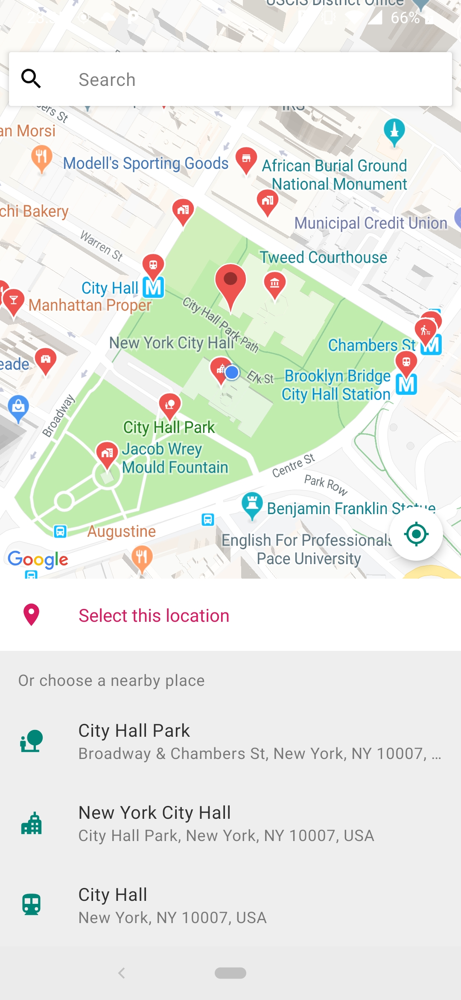
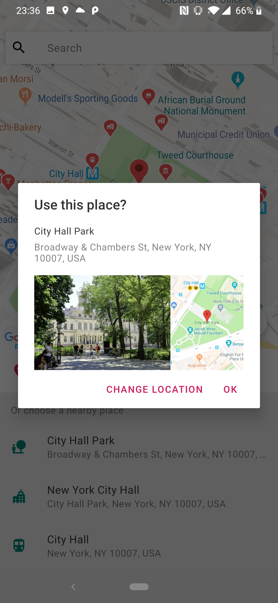
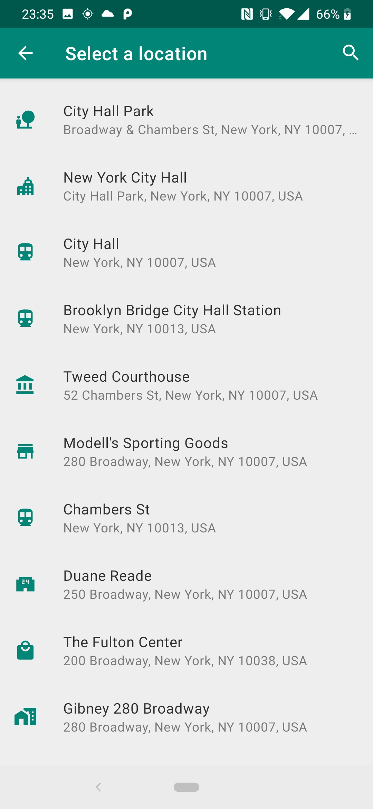

# PING - Because Ping Is Not Google's Place Picker 😉
[](https://jitpack.io/#rtchagas/pingplacepicker)

 
If you're here looking for a place picker you have probably read this:


As of the end of January 2019, Google deprecated the so useful Place Picker bundled in the Places SDK for Android.
The main reason was due the new pricing model of the [Places API](https://developers.google.com/places/android-sdk/usage-and-billing).

**PING** Place Picker is here to help you to (almost) plug-and-play replace the original Google's Place Picker.

   

## A key difference

Different than Google's Place Picker, PING **doesn't** search for places according to where the user is pointing the map to. Instead, it shows only the nearby places of the **current** location.

This was intentional and the reason is simple. By using the **/nearbysearch** from [Google Places Web API](https://developers.google.com/places/web-service/search#PlaceSearchRequests) we are going to be charged *a lot* for each map movement.


According to [Nearby Search pricing](https://developers.google.com/maps/billing/understanding-cost-of-use#nearby-search) each request to the API is going to cost 0.04 USD per each (40.00 USD per 1000).

To avoid our money being burned by using **/nearbysearch**, PING relies on Place API's **findCurrentPlace()** that is going to cost 0.030 USD per each  (30.00 USD per 1000).

Moreover, we don't fire a new request when the user moves the map.


## Download

Add Jitpack in your root build.gradle at the end of repositories:

	allprojects {
		repositories {
			...
			maven { url 'https://jitpack.io' }
		}
	}
  
Step 2. Add the dependency

	dependencies {
	        // Places library  
            implementation 'com.google.android.libraries.places:places:1.0.0'
	        // PING Place Picker
	        implementation 'com.github.rtchagas:pingplacepicker:1.0.+'
	}

## Setup

 1. Add Google Play Services to your project - [How to](https://developers.google.com/android/guides/setup)
 2. Sign up for API keys - [How to](https://developers.google.com/places/android-sdk/signup)
 3. Add the Android API key to your **AndroidManifest** file as in the [sample project](https://github.com/rtchagas/pingplacepicker/blob/master/sample/src/main/AndroidManifest.xml#L15).
 4. Optional but strongly recommended to enable R8 in you *[gradle.properties](https://github.com/rtchagas/pingplacepicker/blob/master/gradle.properties#L12)* file

## Hands on

Check the [sample](https://github.com/rtchagas/pingplacepicker/tree/master/sample) project for a full working example.

### - Kotlin
```kotlin
    private fun showPlacePicker() {  
        val pingBuilder = PingPlacePicker.IntentBuilder()  
        pingBuilder.setAndroidApiKey("YOUR_ANDROID_API_KEY")  
        pingBuilder.setGeolocationApiKey("YOUR_GEOLOCATION_API_KEY")
        try {
            val placeIntent = pingBuilder.build(this)
            startActivityForResult(placeIntent, REQUEST_PLACE_PICKER)
        }
        catch (ex: Exception) {  
            toast("Google Play Services is not Available")  
        }
    }
    
    override fun onActivityResult(requestCode: Int, resultCode: Int, data: Intent?) {  
	super.onActivityResult(requestCode, resultCode, data)  
	if ((requestCode == REQUEST_PLACE_PICKER) && (resultCode == Activity.RESULT_OK)) {  
	    val place: Place? = PingPlacePicker.getPlace(data!!)  
	    toast("You selected: ${place?.name}")  
	}  
    }
```

### - Java
```java
    private void showPlacePicker() {
	PingPlacePicker.IntentBuilder builder = new PingPlacePicker.IntentBuilder();
	builder.setAndroidApiKey("YOUR_ANDROID_API_KEY")  
	       .setGeolocationApiKey("YOUR_GEOLOCATION_API_KEY");
	try {
	    Intent placeIntent = builder.build(getActivity());  
	    startActivityForResult(placeIntent, REQUEST_PLACE_PICKER);  
	}  
	catch (Exception ex) {  
	    // Google Play services is not available... 
	}
    }
    
    @Override  
    public void onActivityResult(int requestCode, int resultCode, Intent data) {  
        if ((requestCode == REQUEST_PLACE_PICKER) && (resultCode == RESULT_OK)) {  
            Place place = PingPlacePicker.Companion.getPlace(data);  
	    if (place != null) {  
                Toast.makeText(this, "You selected the place: " + place.getName(), Toast.LENGTH_SHORT).show();
            }  
        }
    }
```

## API Keys

PING needs two API keys in order to work.

It was decided to split the API keys to clearly distinguish what you're going to be charged for. Also, the Geolocation API does not allow an Android API key to be used. To not expose an unrestricted key for all APIs, the Geolocation API key is now required.

| Key | Restriction | Purpose
|--|--|--|
| Android key | [Android Applications](https://developers.google.com/places/android-sdk/signup#restrict-key) | Used as the Places API key. Main purpose is to retrieve the nearby places.
| Geolocation key | [API: Geolocation API only](https://cloud.google.com/docs/authentication/api-keys#api_key_restrictions) | Used to perform reverse geocoding on the current user position. That is, discover the address that the user is current pointing to.

## Configuration

As some features are charged by Google, you can alter the default **PING** Place Picker behaviour by overriding below resources:

```xml  
<!-- 0.002 USD per each (2.00 USD per 1000) -->  
<bool name="show_confirmation_photo">true</bool>  

<!-- 0.007 USD per each (7.00 USD per 1000) -->  
<bool name="show_confirmation_map">true</bool>
```

## Contribute

Let's together make PING awesome!

Please feel free to contribute with improvements.

<!--stackedit_data:
eyJoaXN0b3J5IjpbLTE2OTEwOTMwMTIsNjk1MDQ1MzY0LDE4NT
I5NDk5MDUsMjAwMTQ0MzM5OSwyODIyMTI1MjFdfQ==
-->
