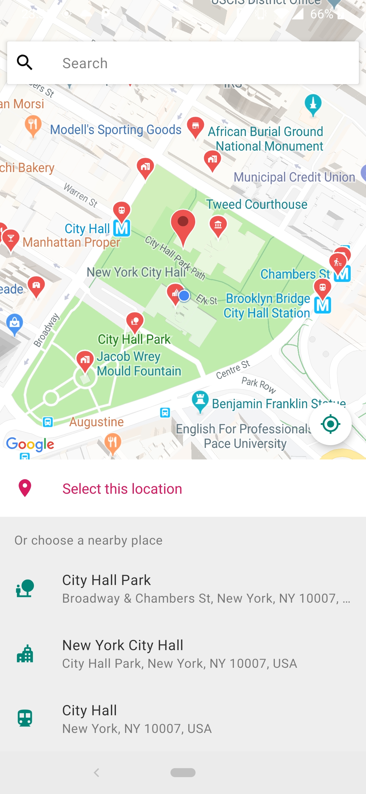
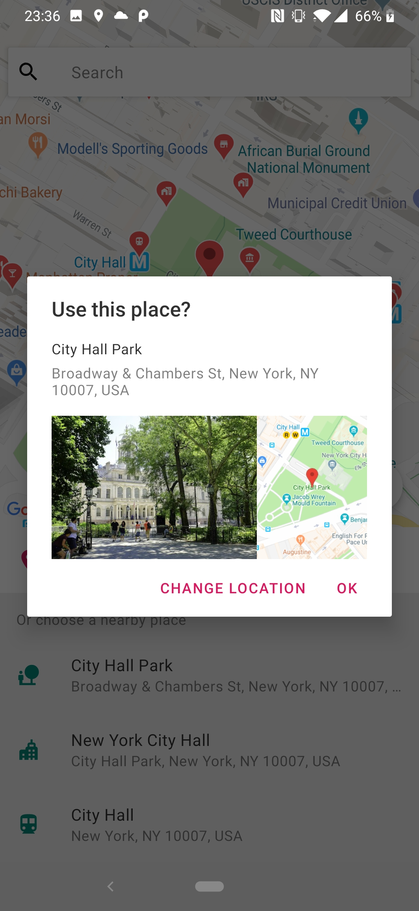
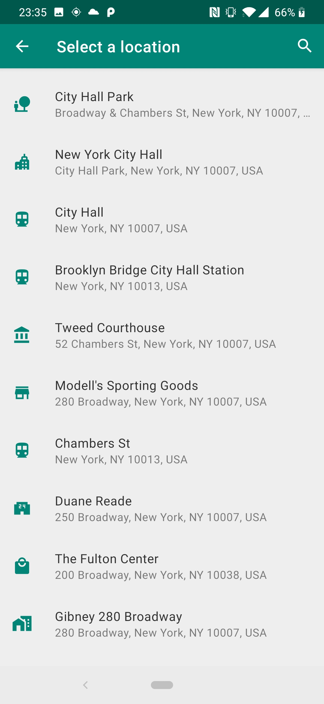
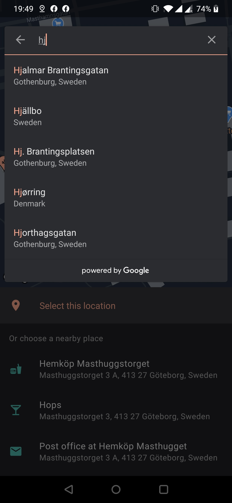

# PING — Because Ping Is Not Google's Place Picker 😉

[](https://jitpack.io/#rtchagas/pingplacepicker) [](#)

A modern, drop-in replacement for the long-deprecated Google Place Picker. Built on
the Places SDK for Android (**New**) — `searchNearby` for the picker grid,
programmatic autocomplete for the search bar, and a Coil-loaded photo preview in
the confirmation dialog.

   

## At a glance

- **Places SDK 5.x (New)** — uses `SearchNearbyRequest`, `FindAutocompletePredictionsRequest`, `FetchPlaceRequest`, and `FetchResolvedPhotoUriRequest`
- **Coroutines / Flow** end to end — no RxJava, no `LiveData`, no `AsyncTask`
- **ActivityResultContract API** — no `startActivityForResult`, no static result callbacks
- **min SDK 24**, AGP 9, Kotlin 2.3, Gradle 9.4

## Install

Add JitPack to your settings:

```kotlin
// settings.gradle.kts
dependencyResolutionManagement {
    repositories {
        google()
        mavenCentral()
        maven(url = "https://jitpack.io")
    }
}
```

Add the dependency:

```kotlin
// app/build.gradle.kts
dependencies {
    implementation("com.google.android.libraries.places:places:5.1.1")
    implementation("com.github.rtchagas:pingplacepicker:<latest-version>")
}
```

## Setup

1. **Enable APIs in Google Cloud Console** on the project tied to your keys:
    - **Places API (New)** — required for `searchNearby`, `findAutocompletePredictions`, `fetchPlace`, and `fetchResolvedPhotoUri`
    - **Maps SDK for Android** — required for the map fragment
    - **Maps Static API** — only if you want the static map preview in the confirmation dialog
2. **Add Google Play Services** to your project — [setup guide](https://developers.google.com/android/guides/setup)
3. **Create API keys** — [sign up guide](https://developers.google.com/places/android-sdk/signup)
4. **Add your Places key** to your manifest as `com.google.android.geo.API_KEY` — see the [sample manifest](sample/src/main/AndroidManifest.xml)

## Usage

```kotlin
class MyActivity : AppCompatActivity() {

    private val placePickerLauncher = registerForActivityResult(PingPlacePicker.Contract()) { result ->
        result ?: return@registerForActivityResult
        // result.place is the Google Places SDK Place
        // result.latLng is the camera target at confirmation time
        toast("You picked ${result.place.displayName}")
    }

    private fun showPicker() {
        placePickerLauncher.launch(
            PingPlacePicker.Request(
                androidApiKey = getString(R.string.places_api_key),
                mapsApiKey = getString(R.string.maps_static_api_key), // optional
                initialLocation = null,                                // optional
            ),
        )
    }
}
```

That's it. The contract:

- Returns `PingPlacePicker.Result?` — `null` when the user cancels
- Throws `GooglePlayServicesNotAvailableException` from `launch(...)` if Play Services isn't available — wrap in a try/catch if you need to handle it

## API keys

PING uses one or two keys depending on which features you turn on:

| Key | Required? | Used for | Restriction |
| --- | --- | --- | --- |
| `androidApiKey` | always | Places SDK calls (nearby search, autocomplete, fetch place, photo URI) | [Android-package restriction](https://developers.google.com/places/android-sdk/signup#restrict-key) is fine |
| `mapsApiKey` | only if `show_confirmation_map` is `true` | The static-map preview rendered in the confirmation dialog (Maps Static API) | The Static API doesn't accept Android-package restrictions — use an IP or unrestricted key |

**Tip:** don't ship a Maps Static API key inside your APK if you can avoid it — anyone can decompile and lift it. Prefer fetching it at runtime from a backend or remote config.

## Configuration

Override these bools/integers in your app's resources to change behaviour:

```xml
<!-- Show the place photo in the confirmation dialog.
     Place Photo (New) — Enterprise tier, $7/1000 calls after 1000/month free -->
<bool name="show_confirmation_photo">true</bool>

<!-- Show a static-map preview in the confirmation dialog.
     Maps Static API — Essentials tier, $2/1000 calls after 10000/month free -->
<bool name="show_confirmation_map">true</bool>

<!-- Pan the map to the marker when the user taps it -->
<bool name="auto_center_on_marker_click">false</bool>

<!-- Radius in metres used for both nearby search and the autocomplete location bias -->
<integer name="autocomplete_search_bias_radius">5000</integer>

<!-- Initial zoom level applied to the map -->
<integer name="default_zoom">17</integer>
```

## Pricing

PING uses these Places API (New) and Maps Platform SKUs. Prices below are the
default pay-as-you-go rates for the first 100,000 calls per month, after the
free monthly allowance is exhausted:

| Action | SKU | Tier | Free / month | Price |
| --- | --- | --- | --- | --- |
| Opening the picker | Nearby Search (New) | Pro | 5,000 | **$32 / 1K** |
| Tapping a search prediction | Place Details (New) — `fetchPlace` | Pro | 5,000 | **$17 / 1K** |
| Typing in the search bar | Autocomplete (New) | — | unlimited¹ | **$0** |
| Confirmation photo (optional) | Place Photo (New) — `fetchResolvedPhotoUri` | Enterprise | 1,000 | **$7 / 1K** |
| Confirmation static-map preview (optional) | Maps Static API | Essentials | 10,000 | **$2 / 1K** |

¹ Autocomplete keystrokes are billed under "Autocomplete Session Usage" ($0)
because each session is terminated by a Place Details Pro call (`fetchPlace`).
If the user dismisses the picker without selecting a prediction the keystrokes
fall back to "Autocomplete Requests" at $2.83 / 1K (first 10,000/month free).

The tier of `searchNearby` and `fetchPlace` is driven by the
[field mask](https://developers.google.com/maps/documentation/places/web-service/place-details#fieldmask)
PING requests — `ID`, `DISPLAY_NAME`, `FORMATTED_ADDRESS`, `LOCATION`, `TYPES`,
`PHOTO_METADATAS`. Adding atmosphere/enterprise fields (rating, reviews, opening
hours, etc.) would bump the whole call up to the Enterprise tier.

Disable `show_confirmation_photo` and `show_confirmation_map` if you want to
keep usage strictly within the Places SDK Pro tier and avoid the Static Maps
key altogether.

For the full SKU breakdown and volume discounts, see the
[Google Maps Platform pricing page](https://developers.google.com/maps/billing-and-pricing/pricing)
and the [SKU details](https://developers.google.com/maps/billing-and-pricing/sku-details).

## Theming

PING follows your app's Material colors. Override these in `res/values/colors.xml` (and `res/values-night/colors.xml` for dark mode):

```xml
<color name="colorPrimary">@color/material_teal500</color>
<color name="colorPrimaryDark">@color/material_teal800</color>
<color name="colorOnPrimary">@color/material_white</color>

<color name="colorSecondary">@color/material_deeporange500</color>
<color name="colorSecondaryDark">@color/material_deeporange800</color>
<color name="colorOnSecondary">@color/material_white</color>

<color name="colorBackground">@color/material_grey200</color>
<color name="colorOnBackground">@color/material_black</color>

<color name="colorSurface">@color/material_white</color>
<color name="colorOnSurface">@color/material_black</color>

<color name="textColorPrimary">@color/material_on_surface_emphasis_high_type</color>
<color name="textColorSecondary">@color/material_on_surface_emphasis_medium</color>

<color name="colorMarker">@color/material_deeporange400</color>
<color name="colorMarkerInnerIcon">@color/material_white</color>
```

See the [sample app](sample/) for a complete example.

## Migrating from 3.0.1

This release is a major rewrite. Highlights of the breaking changes:

| Before (≤ 3.0.1) | After |
| --- | --- |
| `PingPlacePicker.Builder().build(activity)` + `startActivityForResult` | `registerForActivityResult(PingPlacePicker.Contract())` + `launcher.launch(Request(...))` |
| `OnPlaceSelectedListener` (static) | `Result(place, latLng)` returned via the contract |
| `PingPlacePicker.getPlace(data)` in `onActivityResult` | Receive `Result` in the registered callback |
| `setMapsApiKey` (required) | `mapsApiKey` (optional — only needed for the static-map preview) |
| `setUrlSigningSecret` | Removed — pass a non-URL-restricted key instead |
| `setShouldReturnActualLatLng` | Removed — `result.latLng` is always the camera target at confirmation |
| `enable_nearby_search` bool | Removed — `searchNearby` is the only path now (Places SDK New) |
| `Place.Type` enum results | String types via `place.placeTypes: List<String>` |
| `Place.name` / `Place.address` / `Place.latLng` getters | `place.displayName` / `place.formattedAddress` / `place.location` |
| min SDK 19 | min SDK 24 (required by Places SDK 5.x) |

You'll also need to enable **Places API (New)** in your Google Cloud project — the legacy "Places API" is not enough.

## License

```
Copyright 2020 Rafael Chagas

Licensed under the Apache License, Version 2.0 (the "License");
you may not use this file except in compliance with the License.
You may obtain a copy of the License at

   http://www.apache.org/licenses/LICENSE-2.0

Unless required by applicable law or agreed to in writing, software
distributed under the License is distributed on an "AS IS" BASIS,
WITHOUT WARRANTIES OR CONDITIONS OF ANY KIND, either express or implied.
See the License for the specific language governing permissions and
limitations under the License.
```
